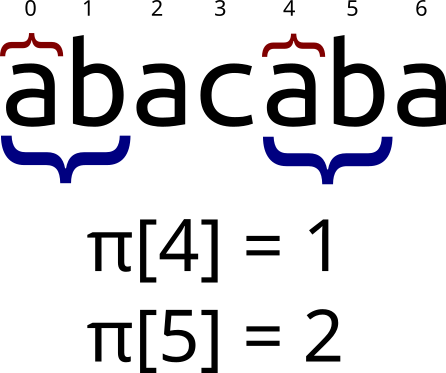

## Префикс-функция

Префикс-функция от строки $$s$$ равна массиву $$\pi$$, где $$\pi[i]$$ обозначает длину
максимального префикса строки $$s[0..i]$$, совпадающего с её суффиксом. Тривиальные
случаи (префикс равен суффиксу и равен всей строке) не учитываются.

На изображении обозначены равные подстроки, длина которых равна значению
префикс-функции в данной позиции. Префикс-функция от всей строки "abacaba"
равна $$\{0, 0, 1, 0, 1, 2, 3\}$$. $$\pi[0] = \pi[1] = 0$$ так как строки
"a" и "ab" являются тривиальными, и поэтому не учитываются.

В определённых случаях префикс и суффикс могут перекрываться:

Наивный алгоритм нахождения префикс-функции имеет сложность $$O(N^3)$$, что
неприемлемо для большинства случаев. Существует гораздо более эффективный
алгоритм, работающий за $$O(N)$$.

## Алгоритм Кнута-Морриса-Пратта

Алгоритм Кнута-Морриса-Пратта (КМП) позволяет находить префикс-функцию от
строки за линейное время, и имеет достаточно лаконичную реализацию, по длине
не превышающую наивный алгоритм.

Для начала заметим важное свойство: $$\pi[i] \le \pi[i - 1] + 1$$. То есть
префикс-функция от следующего элемента не более чем на $$1$$ превосходит
префикс-функцию от текущего. Случай $$\pi[i] = \pi[i - 1] + 1$$ легко изобразить:

То есть верно следующее утверждение (в 0-индексации):

$$s[i] = s[\pi[i - 1]] \Rightarrow \pi[i] = \pi[i - 1] + 1$$

Этот случай достаточно тривиален. Но что если $$s[i] \ne s[\pi[i - 1]]$$?
Хотелось бы найти такую длину $$j$$, что $$s[0..j - 1] = s[i - j..i - 1]$$, но
при этом $$j < \pi[i - 1]$$. Если $$s[i] = s[j]$$, то $$\pi[i] = j + 1$$. На
самом деле, длина $$j$$ уже была найдена в процессе нахождения префикс-функции.
А именно, $$j = \pi[\pi[i - 1] - 1]$$. Графически это выглядит так:

Если же длина $$j$$ также не подходит ($$s[i] \ne s[j]$$), просто ещё раз уменьшим
её по такой же формуле: $$j = \pi[j - 1]$$. Таким образом будем пытаться продолжить
префикс длины $$j$$, пока $$j$$ не станет равно $$0$$. В таком случае просто сравним
$$s[i]$$ с $$s[0]$$, и в зависимости от результата присвоим $$\pi[i] = 0$$ или $$1$$.

## Реализация


vector<int> prefix_function(const string& s) {
    vector<int> pi(s.length(), 0);

    for (int i = 1; i < s.length(); i++) {
        int j = pi[i - 1];  //текущая длина префикса, который мы хотим продолжить
                            //гарантируется, что s[0..j-1] = s[i-j..i-1].

        while (j > 0 && s[i] != s[j]) {     //пока мы не можем продолжить текущий префикс
            j = pi[j - 1];  //уменьшаем его длину до следующей возможной
        }

        //Теперь j - максимальная длина префикса, который мы можем продолжить,
        //или 0, если такового не существует.

        if (s[i] == s[j]) {
            pi[i] = j + 1;
        } else {    //такое может произойти только при j = 0
            pi[i] = j;
        }
    }

    return pi;
}


## Пример применения префикс-функции

Префикс-функция - необычайно мощная структура, с помощью которой решается
значительная часть задач про строки. Классической задачей на префикс-функцию
является задача на поиск подстроки в строке (алгоритм КМП был изначально разработан
именно для решения этой задачи). Разберём её в качестве примера.

Пусть нам нужно найти подстроку $$t$$ в строке $$s$$. С помощью префикс-функции это
делается тривиально: найдём префикс-функцию от строки $$t + \# + s$$ (решётка обозначает
символ, гарантированно не встречающийся ни в одной из строк). Если эта префикс-функция
содержит значения равные длине $$t$$, значит $$t$$ входит в $$s$$. А именно, пусть
$$\pi[i] = \vert t \vert$$. Значит $$s[i - \vert t \vert - 1]$$ - последний символ
вхождения $$t$$ в $$s$$.

Реализация на C++:


#include <bits/stdc++.h>

using namespace std;

vector<int> prefix_function(const string& s) {
    vector<int> pi(s.length(), 0);

    for (int i = 1; i < s.length(); i++) {
        int j = pi[i - 1];

        while (j > 0 && s[i] != s[j]) {
            j = pi[j - 1];
        }

        if (s[i] == s[j]) {
            pi[i] = j + 1;
        } else {
            pi[i] = j;
        }
    }

    return pi;
}

int main() {
    string s, t;
    cin >> s >> t;

    vector<int> pi = prefix_function(t + '#' + s);

    int t_len = t.length();

    for (int i = 0; i < s.length(); i++) {
        if (pi[t_len + 1 + i] == t_len) {
            cout << "s[" << i - t_len + 1 << ".." << i << "] = t" << endl;
        }
    }
}


